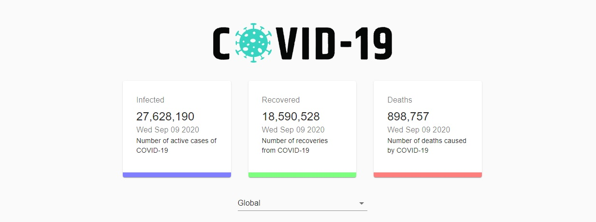
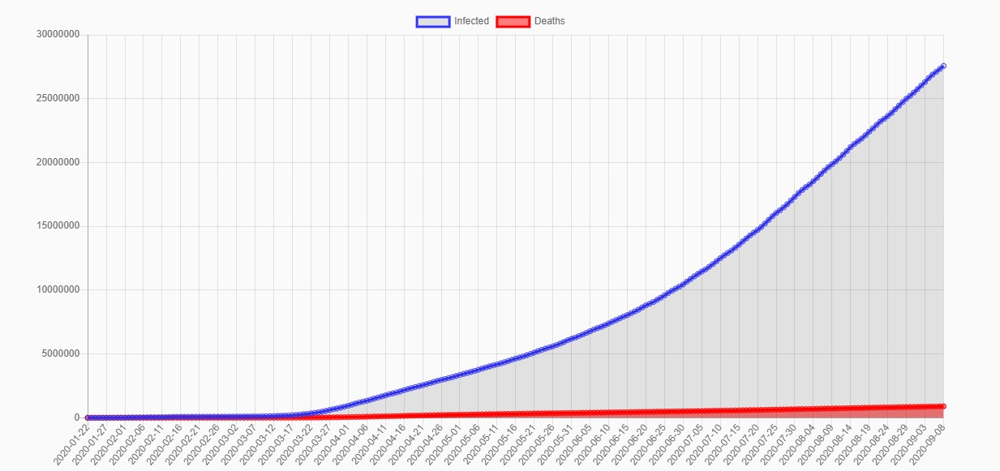

# Covid-19 Tracker

> Get the latest statistics globaly and for a specific country

## Screenshots




## How To Use 

From your command line, clone and run developer-portfolio:

```bash
# Clone this repository
$ git clone https://github.com/ysherqawi/covid19-tracker.git

# Go into the repository
$ cd covid19-tracker

# Install dependencies
$ npm install

#Start's development server
$ npm start

```

## Tech/framework used

- React ( [visit website](https://reactjs.org/) )
- Packages:
  - Material UI ( [visit package page](https://npmjs.com/package/@material-ui/core) )
  - Axios ( [visit package page](https://npmjs.com/package/axios) )
  - React Chart.js 2 ( [visit package page](https://npmjs.com/package/react-chartjs-2) )
  - Classnames ( [visit package page](https://npmjs.com/package/classnames) )

## Credits

Channel: JavaScript Master

Video: [Click Here](https://www.youtube.com/watch?v=khJlrj3Y6Ls)